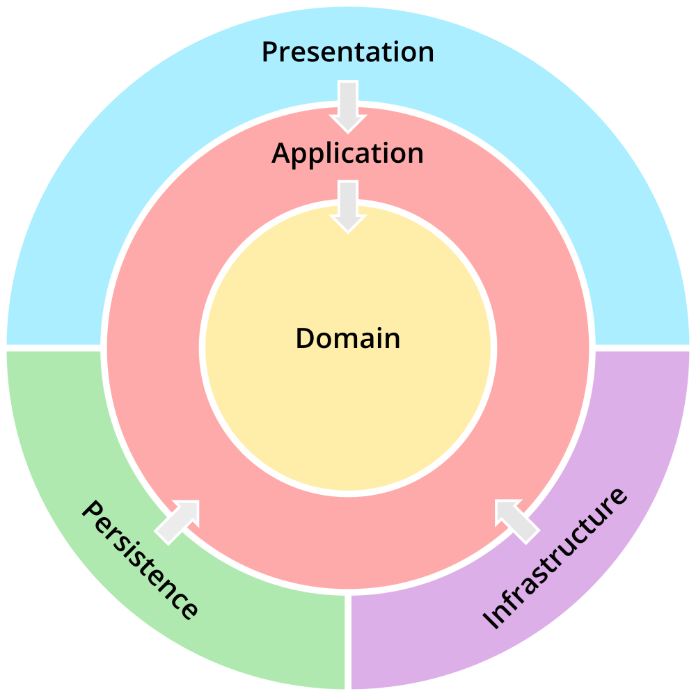

# Sales

[](https://opensource.org/licenses/MIT)


This project presents an implementation of the authors' interpretation of Martin's Clean Architecture in a Java Spring API. The following diagram presents the layer orchestration:



## Getting Started

This API store information about products available in a regular store and about sales involving these products.

### Requirements

- [JDK 17](https://openjdk.java.net/projects/jdk/17/)
- [Maven 3.8.5](https://maven.apache.org/download.cgi)

For development, make sure you have an IDE. We strongly recommend [IntelliJ](https://www.jetbrains.com/idea/).

### Documentation

The software requirements are available [here](./docs/requirements.md).

The system diagrams are available [here](./docs/diagrams.drawio). You will need to open the file with [draw.io](https://app.diagrams.net/).

### Installation

Install all dependencies with:

```
mvn clean install
```

### Test

Run all tests with:

```
mvn test
```

### Build

Generate an artifact with:

```
mvn package
```

## Authors

- [Dêner José Ribeiro](https://github.com/DenerRibeiro)
- [Eduardo Augusto de Oliveira](https://github.com/eduardo0401)
- [Leonardo Furtado de Oliveira](https://github.com/leonfoliveira)
